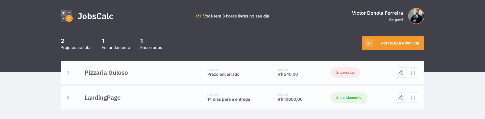

# 🧮 jobsCalc

## 📖 Sobre

O **jobsCalc** é um aplicativo simples e funcional feito pra quem vive de **freelas** e quer parar de cobrar “de cabeça”.
Com ele, dá pra registrar seus **jobs (trabalhos)**, excluir quando não precisar mais, e calcular **quanto cada projeto realmente vale** — tudo com base no **valor da sua hora de trabalho**.

Nada de chute ou planilha perdida: o sistema faz as contas e mostra uma estimativa justa do custo do projeto.

---

## 🧰 Funcionalidades

* 📝 **Cadastro de jobs** — registre o nome, valor e tempo estimado de cada projeto.
* 💰 **Cálculo automático** — o app calcula o custo com base na sua taxa por hora.
* ❌ **Exclusão de jobs** — apague o que já foi concluído ou cancelado.
* ⚙️ **Configuração do valor-hora** — personalize o valor do seu tempo.
* 📊 **Painel resumido** — visualize quantos jobs estão em andamento e quantas horas disponíveis você ainda tem.

---

## 🧠 Tecnologias utilizadas

Esse projeto foi desenvolvido com:

* [JavaScript](https://developer.mozilla.org/pt-BR/docs/Web/JavaScript)
* [Node.js](https://nodejs.org/en/)
* [Express](https://expressjs.com/pt-br/)
* [EJS](https://ejs.co/)
* [Nodemon](https://www.npmjs.com/package/nodemon) (pra facilitar o desenvolvimento)

---

## ⚙️ Como rodar o projeto

1. **Clone o repositório**

   ```bash
   git clone https://github.com/vdonoladev/jobsCalc.git
   ```

2. **Acesse o diretório**

   ```bash
   cd jobsCalc
   ```

3. **Instale as dependências**

   ```bash
   npm install
   ```

4. **Inicie o servidor**

   ```bash
   npm start
   ```

   Ou, durante o desenvolvimento:

   ```bash
   npm run dev
   ```

5. **Acesse o app**

   ```
   http://localhost:3000
   ```

---

## 💻 Preview



---

## 🔧 Melhorias futuras

* [ ] Banco de dados integrado (SQLite ou MongoDB)
* [ ] Filtros e ordenação de jobs
* [ ] Tema escuro 🌙
* [ ] Exportar relatórios em PDF

---

## 🧾 Licença

Este projeto está sob a licença **MIT**.
Confira o arquivo [LICENSE](LICENSE) para mais detalhes.

---

## 👨‍💻 Autor

Feito com dedicação e uns bons cafés ☕ por **Víctor**
👉 [LinkedIn](https://linkedin.com/in/vdonoladev) | [GitHub](https://github.com/vdonoladev)
